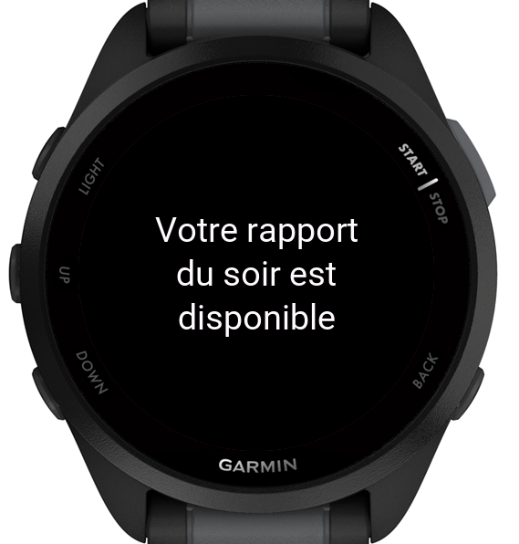
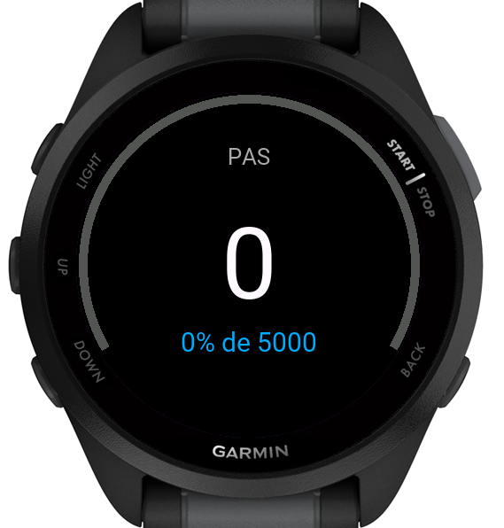
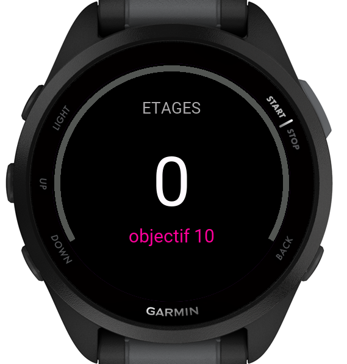
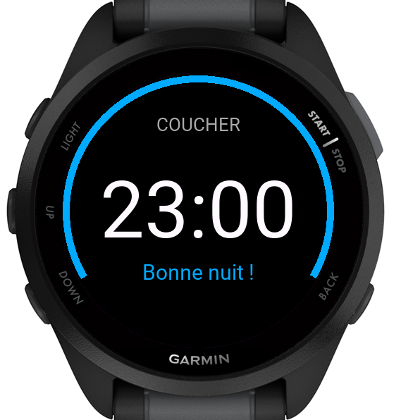

# EWIQ  

Evening Widget IQ is a Monkey C program for garmin watches to bring evening-report-like functionnality from high-end garmin to all compatible models
  
## Informations  
  
When it's evening notification time (you can change these in settings later, default 8pm), report automatically shows on your watch with these informations :  
  

|Screen|Infos|
|-----|-----|
|1|Current steps - Goal - %|
|2|Current floors climbed - Goal|
|3|Detection of sleep time goal -> sleep time shows & recommendations|
  

  
|Type|Infos|
|----|----|
|Language|Monkey C|
  
## Coming soon  
  
- Changing or adapting to watch language
- Other datas
  
## Devices  
  
|Device name|Status|Version|
|------|------|------|
|ForeRunner 165|SUPPORTED|TEST 0.1|
|ForeRunner 55|PLANNED|-|
  
## Installation  
  
1. Please go to  and download PRG package (Garmin PKG format) for your device.  
2. Plug your device into your computer. If asks, type your code on watch.  
3. Open file explorer and go to GarminWatch_InternalStorage/GARMIN/Apps and drag PRG here.  
4. Enjoy !  
  
## License
This project is licensed under the GNU General Public License v3.0 — see the [LICENSE](LICENSE) file for details.
  
## Author  
Thekorzeremi
